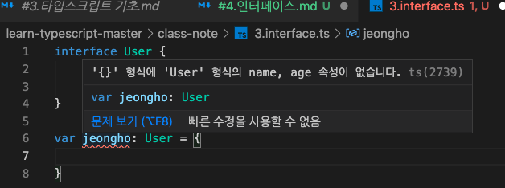
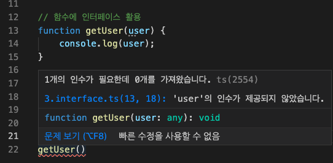
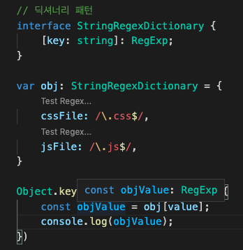
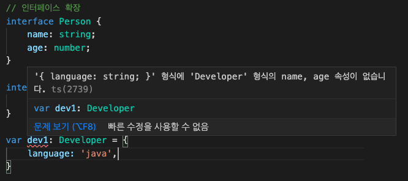

# 인터페이스 소개
- interface 기본 구조
```javascript
interface User {
    name: string,
    age: number,
}

// 변수에 활용한 인터페이스
var jeongho: User = {
    name: 'jeongho',
    age: 30,
}
```
- `interface` 에 정의된 속성을 지정하지 않을 경우, 아래와 같은 에러 표시


# 함수의 인자를 정의하는 인터페이스
```js
interface User {
    name: string,
    age: number,
}

// 함수에 인터페이스 활용
function getUser(user: User) {
    console.log(user);
}

const user1 = { //name 속성만 가지는 Object를 getUser의 파라미터로 전달할 경우, `age`를 선언해야 한다고 에러 표시
    name: 'user1',
}

getUser(user1);
```

# 함수의 구조를 정의하는 인터페이스
- 함수의 전체적인 모습까지 인터페이스로 정의 할 수 있다.
```js
// 함수의 스펙(구조)에 인터페이스를 활용
interface SumFunction {
    (a: number, b: number): number
}

let sum: SumFunction;
sum = function(a: number, b: number): number {
// sum = function(a, b) {
    return a + b;
}
```
   

* * *

# 인터페이스 딕셔너리 패턴
```js
// 딕셔너리 패턴
interface StringRegexDictionary {
    [key: string]: RegExp;
}

var obj: StringRegexDictionary = {
    cssFile: /\.css$/,
    jsFile: /\.js$/,
}

Object.keys(obj).forEach(value => {
    const objValue = obj[value];
    console.log(objValue);
})
```
   

# 인터페이스 확장
```js
interface Person {
    name: string;
    age: number;
}

interface Developer extends Person {
    language: string;
}

var dev1: Developer = {
    language: 'java',
    name: 'dev1',
    age: 30,
}
```
   
