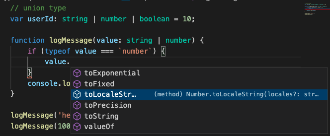
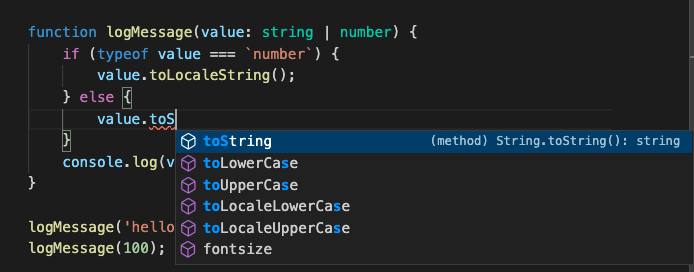
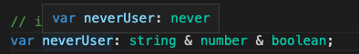

# 연산자를 이용한 타입 정의
- `Union Type` `|`(=or) 연산자를 이용하여 타입 정의
```js
// union type
function logMessage(value: string | number) {
    console.log(value);
}

logMessage('hello');
logMessage(100);
```

# Union Type의 장점
- 두 가지 이상의 타입을 쓰고 싶을 경우에 사용 가능
- 두 가지 이상의 타입을 확정 지을 수 있는 시점에는 해당 타입으로 추론되어 사용가능
(타입가드 : 특정 타입으로 타입의 범위를 좁혀나가는(필터링 하는) 과정)
```js
function logMessage(value: string | number) {
    if (typeof value === `number`) {
        value.toLocaleString();
    }
    console.log(value);
}
```



# Union Type의 특징
```js
// Union type 특징
interface Developer {
    name: string;
    skill: string;
}

interface Person {
    name: string;
    age: number
}

function askeSomeone(someone: Developer | Person) {
    someone.name;
    someone.skill; // ??
    someone.age; // ??
}
```
- 위 코드에서 `skill`, `age` 는 접근 할 수 없음. 타입카드에 의해 추론이 가능한 상태가 아니라면 불가


# Intersection Type
- `&`(=and) 연산자를 이용하여 타입 정의
```js
var neverUser: string & number & boolean; // never

interface Developer {
    name: string;
    skill: string;
}

interface Person {
    name: string;
    age: number
}

function askeSomeone(someone: Developer & Person) {
    //Developer Type & Perseon Type 두 가지를 모두 충족하는 Type이므로, 모든 속성에 접근 가능
    someone.name;
    someone.age;
    someone.skill;
}
```

