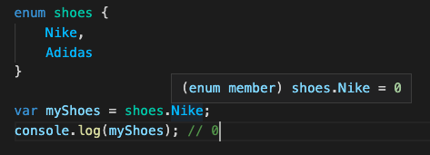
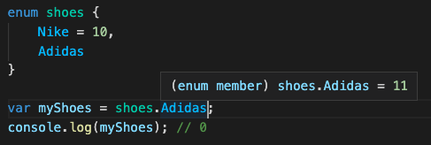
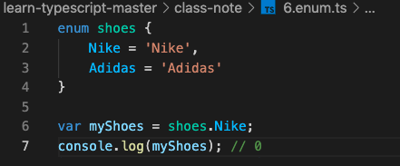

# Enum 소개
- 이넘은 특정 값들의 집합을 의미하는 자료형 (기타 언어들의 enum과 동일)
- 숫자형 Enum
  - 초기화를 하지 않을 경우, 기본적으로 0부터 increase
  - 첫번째 인자에 초기화를 하였다면, 그 다음 수부터 increase


- 문자형 Enum


# Enum 활용 사례
- 기타 언어의 enum 활용 사례와 같음, 아래 코드 참고
```js
function askQuestion(answer: string) {
    if (answer === 'yes') {
        console.log('correct!');
    }

    if (answer === 'no') {
        console.log('try again!');
    }
}
askQuestion('Yes');
askQuestion('y');
askQuestion('Y');

enum Answer {
    Yes,
    No,
}

function askQuestionEnum(answer: Answer) {
    if (answer === Answer.Yes) {
        console.log('correct!');
    }

    if (answer === Answer.No) {
        console.log('try again!');
    }
}
askQuestionEnum(Answer.Yes);
askQuestionEnum(Answer.No);
```