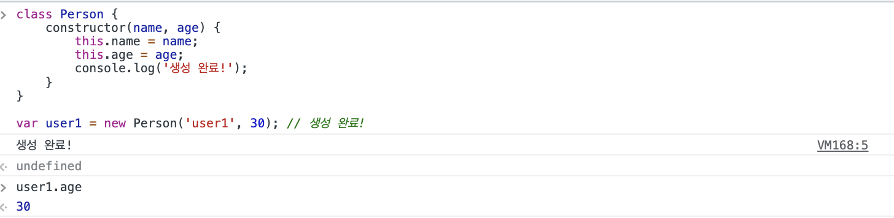
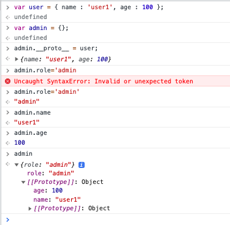

# class 소개
- `ES2015`(=ES6) 부터 소개
```js
class Person {
    constructor(name, age) {
        this.name = name;
        this.age = age;
        console.log('생성 완료!');
    }
}

var user1 = new Person('user1', 30); // 생성 완료!
```


# 자바스크립트 프로토타입 소개
- [MDN 자바스크립트 프로토타입과 상속](https://developer.mozilla.org/en-US/docs/Web/JavaScript/Inheritance_and_the_prototype_chain)   



# 타입스크립트의 클래스 문법
```ts
class PersonTs {
    private name: string; // 접근제한자 사용 가능
    public age: number;
    readonly log: string;

    constructor(name: string, age: number) {
        this.name = name;
        this.age = age;
    }
}

var userTs = new PersonTs('user1', 30);
console.log(userTs.age);
```