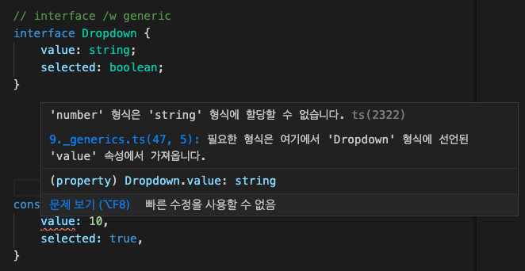

# generic 소개
- 제네릭은 C#, java 등과 같이 프로그래밍 언어에서 재사용성이 높은 컴포넌트를 만들 때 자주 활용되는 특징
- 타입을 마치 함수의 파라미터의 개념으로 전달받게 되는 개념

# generic 기본 문법
```ts
function logText(text) { //text type : any
    console.log(text);
    return text;
}
logText(10); // number 10
logText('hi'); // string hi
logText(true); // true;

function logTextGeneric<T>(text:T): T {
    console.log(text);
    return text;
}

logTextGeneric<number>(10); // number 10
logTextGeneric<string>('hi'); // string hi
logTextGeneric<boolean>(true); // true;
```

# 기존 타입 정의 방식과 제네릭의 차이점 (함수 중복 선언의 단점)
- 기존 타입 정의 방식의 경우, type이 다를 경우 아래 예제 코드와 같이 중복된 코드를 가지는 여러 메소드가 생성 될 수 있음
```ts
// Type 별로 중복된 코드가 생김
function logTextTypeString(text: string) {
    console.log(text);
    text.split('').reverse().join('');
    return text;
}

function logTextTypeNumber(text: number) {
    console.log(text);
    text.toLocaleString();    
    return text;
}
```

# 기존 문법과 제네릭의 차이점 (유니온 타입을 이용한 선언 방식의 문제점)
- `union type`으로 파라미터 전달은 해결 할 수 있지만, return Type의 경우 특정 type으로 추론 할 수 없기 때문에 해당 return 값에 대한 별도의 처리가 필요하다. 
```ts
// Union type
function logTextUnion(text: string | number) {
    console.log(text);
    return text;
}

const logValue = logTextUnion('hi');
logValue.
logTextUnion(10);
```
- string type의 파라미터를 전달하여도, 반환값도 string type이라 보장 할 수 없기에, string type의 API(ex: split)을 사용할 수 없다.


# 제네릭의 장점과 타입 추론에서의 이점
- return type까지 추론을하여 해당 retury type의 API 사용 가능


# 인터페이스에 제네릭을 선언하는 방법
```ts
interface DropdownGeneric<T> {
    value: T;
    selected: boolean;
}
const objGener1: DropdownGeneric<string>  = {
    value: 'hi',
    selected: true,
}
```

- generic을 사용하지 않을 경우, type이 다른 값을 넣었을 때 위 이미지처럼 에러 발생 하는 것을 볼 수 있다.

- 반대로 generic을 올바르게 사용했을 경우, type에 generic을 사용 했을 때와 같이 해당 type API를 사용할 수 있다.


# 정의된 타입으로 제네릭의 타입 제한
- Type을 제한하기 위한 interface 선언 후 extends 하여 해당 type 속성을 상속
```ts
interface LengthType {
    length: number;
}

function logTextLength2<T extends LengthType>(text: T ): T {
    console.log(text.length);
    return text;
}
logTextLength2('hi');
```

- 위 이미지처럼 length 속성을 상속을 통해 generic에 부여하면 해당 generic이 해당 속성을 가지는 걸 볼 수 있다.

# keyof로 제네릭의 타입 제한하기
- keyof를 이용하여 generic의 type 범위를 제한한다.
(keyof는 object의 key들의 literal 값들을 가져온다.)
```ts
interface Person {
    name: string
    age: number
}

function setProperty<T, K extends keyof T>(obj: T, key: K, value: T[K]): void {
    obj[key]=value
}

function getProperty<T, K extends keyof T>(obj: T, key: K): T[K] {
    return obj[key]
}

setProperty(person, 'name', 'Anna')
```